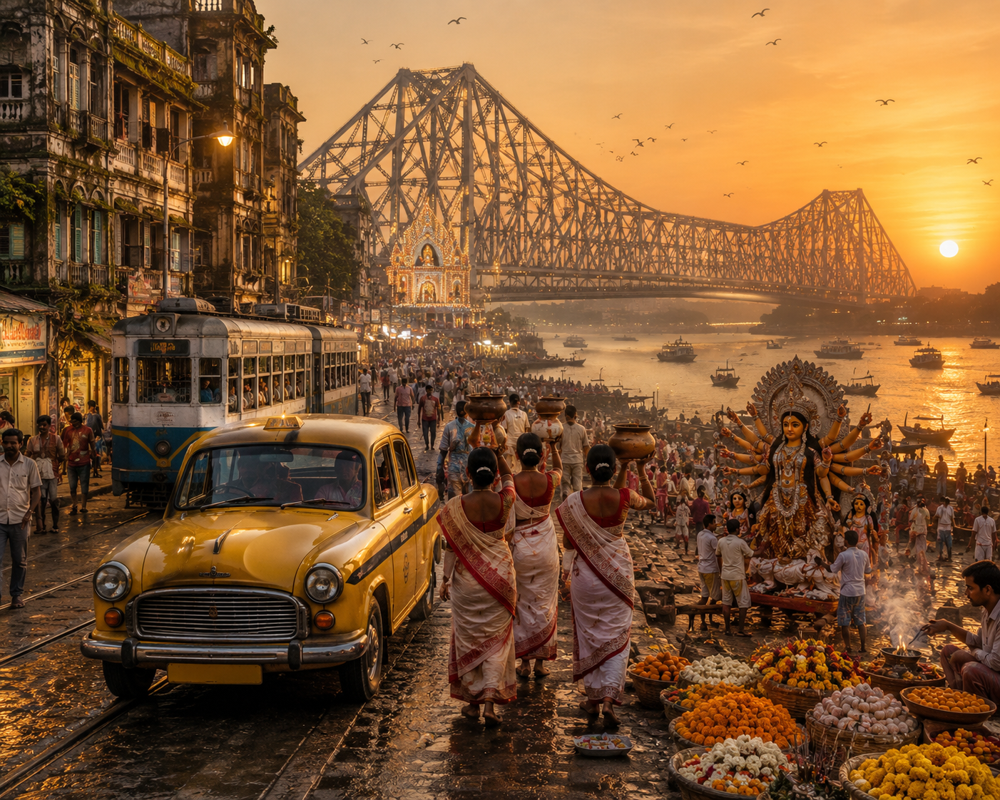

# Which State Am I? Challenge

## Overview
This repository contains my submission for the "Which State Am I?" challenge.

The artwork represents the culture, traditions, architecture, and identity of an Indian state without revealing its name.

## Preview

## Challenge Rules Followed
- No state name mentioned
- AI-generated artwork
- Public GitHub repository
- Cultural identity represented through visual storytelling

## Author
Divya Sri Balla
